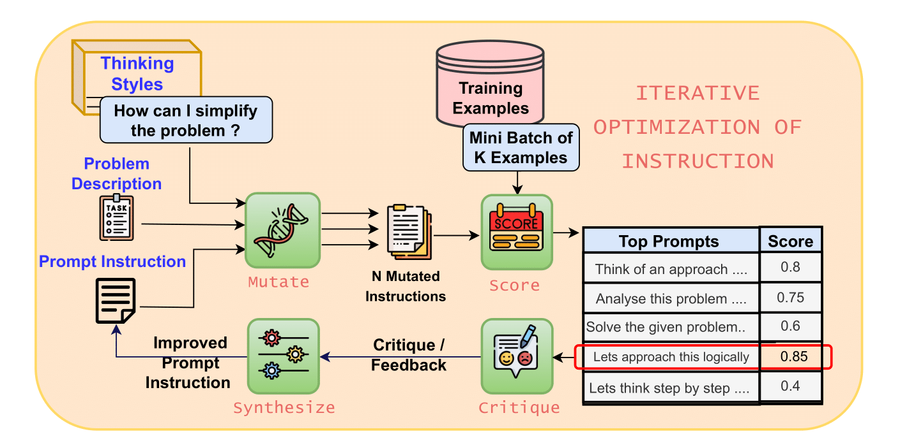
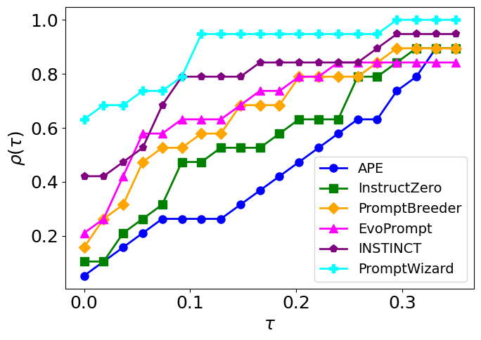

# PromptWizard 🧙

<p align="left">
  <a href='https://arxiv.org/abs/2405.18369'>
    
  </a>
  <a href=''>
    
    Blog Post
  </a>
  <a href=''>
    
    Project Website
  </a>
</p>


> **PromptWizard: Task-Aware Prompt Optimization Framework**<br>
> Eshaan Agarwal, Joykirat Singh, Vivek Dani, Raghav Magazine, Tanuja Ganu, Akshay Nambi <br>

>**Abstract**: <br>
> Large language models (LLMs) have transformed AI across diverse domains, with prompting being central to their success in guiding model outputs. However, manual prompt engineering is both labor-intensive and domain-specific, necessitating the need for automated solutions. We introduce PromptWizard, a novel, fully automated framework for discrete prompt optimization, utilizing a self-evolving, self-adapting mechanism. Through a feedback-driven critique and synthesis process, PromptWizard achieves an effective balance between exploration and exploitation, iteratively refining both prompt instructions and in-context examples to generate human-readable, task-specific prompts. This guided approach systematically improves prompt quality, resulting in superior performance across 45 tasks. PromptWizard excels even with limited training data, smaller LLMs, and various LLM architectures. Additionally, our cost analysis reveals a substantial reduction in API calls, token usage, and overall cost, demonstrating PromptWizard's efficiency, scalability, and advantages over existing prompt optimization strategies.

## Overview 🌟
<p align="center">Overview of the PromptWizard framework</p>


<p align="center">Process of iterative optimization of instructions</p>
<p align="center">
  
</p>

<p align="center">Process of sequential optimization of instruction and examples</p>
<p align="center">

</p>


## Installation ⬇️

Follow these steps to set up the development environment and install the package:

1) Clone the repository
    ```
    git clone https://github.com/microsoft/PromptWizard
    cd PromptWizard
    ```
2) Create and activate a virtual environment

    On Windows
    ```
    python -m venv venv
    venv\Scripts\activate
    ```
    On macOS/Linux:
    ```
    python -m venv venv
    source venv/bin/activate
    ```
3) Install the package in development mode:
    ```
    pip install -e .
    ```


## Quickstart 🏃

- We support [GSM8k](https://huggingface.co/datasets/openai/gsm8k), [SVAMP](https://huggingface.co/datasets/ChilleD/SVAMP), [AQUARAT](https://huggingface.co/datasets/deepmind/aqua_rat) and [Instruction_Induction(BBII)](https://github.com/xqlin98/INSTINCT/tree/main/Induction/experiments/data/instruction_induction/raw) datasets
- Please note that time taken for prompt optimzation is dependent on the dataset. In our experiments for the above mentioned datasets, it took around 20 - 30 minutes on average.

#### High level overview of using PromptWizard
- Load your dataset
  - Follow steps mentioned [here](#create-custom-dataset)
- Fix the configuration and environmental varibles for API calling
  - Use ```promptopt_config.yaml``` to set configurations. For example for GSM8k this [file](demos/gsm8k/configs/promptopt_config.yaml) can be used
  - Use ```.env``` to set environmental varibles. For GSM8k this [file](demos/gsm8k/.env) can be used
  ```
  AZURE_OPENAI_ENDPOINT="XXXXX" 
  # Replace with your Azure OpenAI Endpoint

  OPENAI_API_VERSION="XXXX"
  # Replace with the version of your API

  AZURE_OPENAI_CHAT_DEPLOYMENT_NAME="XXXXX"
  # Create a deployment for the model and place the deployment name here. 
  ```
- Run the code
  - To run PromptWizard on your custom dataset please jump [here](#run-on-custom-dataset) 

#### Running on GSM8k (AQUARAT/SVAMP)

- Please note that this code requires access to LLMs via API calling, we use AZURE endpoints for this
- Set the AZURE endpoint configurations in [.env](demos/gsm8k/.env)
- Follow the steps in [demo.ipynb](demos/gsm8k/demo.ipynb) to download the data, run the prompt optimization and carry out inference.

#### Running on BBII

- BBII has many datasets in it, based on the dataset set the configs [here](demos/bbh/configs/promptopt_config.yaml)
- In configs ```task_description```,```base_instruction``` and ```answer_format``` need to be changed for different datasets in BBII, the rest of the configs remain the same
- A demo is presented in  [demo.ipynb](demos/bbh/demo.ipynb)

## Run on Custom Datasets 🗃️

### Create Custom Dataset
- Our code expects the dataset to be in ```.jsonl``` file format
- Both the train and test set follow the same format
- Every sample in the ```.jsonl``` should have 2 fields :
  1) ```question``` : It should contain the complete question that is to asked to the LLM
  2) ```answer``` : It should contain the ground truth answer which can be verbose or consize


### Run on Custom Dataset

NOTE : Refer to [demos](demos) folder for examples of folders for four datasets. The ```.ipynb``` in each of the folders shows how to run PromptWizard on that particular dataset. A similar procedure can be followed for a new dataset. Below is the explanation of each of the components of the ```.ipynb``` and the dataset specifc folder structure in detail

#### Steps to be followed for custom datasets 

1) Every new dataset needs to have the following 
    - ```configs``` folder to store files for defining optimization hyperparameters and setup configs 
    - ```data``` folder to store ```train.jsonl``` and ```test.jsonl``` as curated [here](#create-custom-dataset) (this is done in the notebooks)
    - ```.env``` file for environment varibles to be used for API calling
    - ```.py/.ipynb``` script to run the code

2) Set the hyperparameters like number of mutations, refine steps, in-context examples etc.
    - Set the following in [promptopt_config.yaml](demos/gsm8k/configs/promptopt_config.yaml) : 
        - ```task_description``` : Desciption of the task at hand which will be fed into the prompt
          - For GSM8k a description like the following can be used
            ```
            You are a mathematics expert. You will be given a mathematics problem which you need to solve
            ```
        - ```base_instruction``` : Base instruction in line with the dataset
          - A commonly used base instruction could be
            ```
            Lets think step by step.
            ```
        - ```answer_format``` : Instruction for specifying the answer format
          - It is crucial to set the ```answer_format``` properly to ensure correct extraction by ```def extract_final_answer()```
          - Answer format could be :
            ```
            At the end, wrap only your final option between <ANS_START> and <ANS_END> tags
            ```
            Then in ```def extract_final_answer()``` we can simply write code to extract string between the tags
          
        - ```seen_set_size``` : The number of train samples to be used for prompt optimization
          - In our experiments we set this to be 25. In general any number between 20-50 would work 
        - ```few_shot_count``` : The number of in-context examples needed in the prompt
          - The value can be set to any positive integer based on the requirement
          - For generating zero-shot prompts, set the values to a small number (i.e between 2-5) and after the final prompt is generated the in-context examples can be removed. We suggest using some in-context examples as during the optimization process the instructions in the prompt are refined using in-context examples hence setting it to a small number will give better zero-shot instructions in the prompt
        - ```generate_reasoning``` : Whether or not to generate reasoning for the in-context examples
          - In our experiments we found it to improve the prompt overall as it provides a step-by-step approach to reach the final answer. However if there is a constraint on the prompt length or number of prompt tokens, it can be turned off to get smaller sized prompts
        - ```generate_expert_identity``` and ```generate_intent_keywords``` : Having these helped improve the prompt as they help making the prompt relevant to the task
    - Refer ```promptopt_config.yaml``` files in folders present [here](demos)  for the descriptions used for AQUARAT, SVAMP and GSM8k. For BBII refer [description.py](demos/bbh/description.py) which has the meta instructions for each of the datasets
3) Create a dataset specific class which inherits ```class DatasetSpecificProcessing``` similar to ```GSM8k(DatasetSpecificProcessing)``` in [demo.ipynb](demos/gsm8k/demo.ipynb) and define the following functions in it
      1) In ```def extract_answer_from_output()``` : This is a dataset specific function, given the ```answer``` from the dataset it should extract and return  a consize form of the answer. Note that based on the dataset it can also simply return the ```answer``` as it is like in case of SVAMP and AQUARAT datasets
      2) ```def extract_final_answer()``` : This is a LLM output specific function, given the verbose answer from the LLM it should extract and return the consize final answer
      3) Define ```def access_answer()``` : This function takes an input the LLM output, then does the following:
         - Extracts the consize answer using ```def extract_final_answer()``` from the LLM output as defined above
         - Evaluates the extracted answer with the ground truth and retuns
            - Extracted answer from LLM output
            - Boolean value indicating if answer is correct or not
         - The evaluation done here is dataset specific, for datasets like GSM8k, SVAMP and AQUARAT which are there final answer as an number we can do a direct match between the numbers generated and the ground truth, while for datasets where the answer is a sentence or paragraph it would be better to do evaluation with llm-as-a-judge, to compare the generated and ground truth paragraph/sentence. An example is available in ```def access_answer()``` in [this](demos/bbh/demo.ipynb) notebook
4) Following are the global parameters which can be set based on th availability of the training data
      - ```use_synthetic_examples``` is a global hyperparameter which can be used to set the type of in-context examples in the final prompt, i.e. it can be synthetic examples or examples from train data or mixture of both
      - ```use_only_synthetic_examples``` is a global hyperparameter which can be used when there are no training samples but in-context examples are required in the final prompt 
      - ```run_without_train_examples``` is a global hyperparameter which can be used when there are no training samples and in-context examples are not required in the final prompt 
      - Scenario based of usage is given below, refer this [notebook](demos/dataset_scenarios_demo.ipynb) for the cells to be replaced with the below:
        - If there is no training data and in-context examples are not required in final prompt, then run
        ```
        best_prompt, expert_profile = gp.get_best_prompt(use_synthetic_examples=False,
                                                        run_without_train_examples=True,
                                                        use_only_synthetic_examples=False)
        ```
        - If there is no training data and synthetic in-context examples are required in final prompt, then run
        ```
        best_prompt, expert_profile = gp.get_best_prompt(use_synthetic_examples=False,
                                                        run_without_train_examples=False,
                                                        use_only_synthetic_examples=True)
        ```
        - If there is training data, then run
        ```
        best_prompt, expert_profile = gp.get_best_prompt(use_synthetic_examples=True,
                                                        run_without_train_examples=False,
                                                        use_only_synthetic_examples=False)
        ```

## How PromptWizard Works 🔍
- Using the problem description and initial prompt instruction, PW generates variations of the instruction by prompting LLMs to mutate it. Based on performance, the best prompt is selected. PW incorporates a critique component that provides feedback, thus guiding and refining the prompt over multiple iterations. 
- PW also optimizes in-context examples. PW selects a diverse set of examples
from the training data, identifying positive and negative examples based on their performance with
the modified prompt. Negative examples help inform further prompt refinements. 
- Examples and instructions are sequentially optimized, using the critique to generate synthetic examples that address the current prompt’s weaknesses. These examples are integrated to further refine the prompt. 
- PW generates detailed reasoning chains via Chain-of-Thought (CoT), enriching the prompt’s capacity for problem-solving. 
- PW aligns prompts with human reasoning by integrating task intent and expert
personas, enhancing both model performance and interpretability.

## Configurations ⚙️ 

Here we define the various hyperparameters used in prompt optimization process found in [promptopt_config.yaml](demos/gsm8k/configs/promptopt_config.yaml)

- ```mutate_refine_iterations```: Number of iterations for conducting mutation of task description
 followed by refinement of instructions
- ```mutation_rounds```: Number of rounds of mutation to be performed when generating different styles
- ```refine_task_eg_iterations```: Number of iterations for refining task description and in context examples 
- ```style_variation```: Number of thinking style variations to be used in prompt mutation
- ```questions_batch_size```: Number of questions to be asked to LLM in a single batch, during training step
- ```min_correct_count```: Minimum number of batches of questions to correctly answered, for a prompt to be considered as performing good
- ```max_eval_batches```: Maximum number of mini-batches on which we should evaluate the prompt
- ```top_n```: Number of top best prompts to be considered from scoring stage for the next stage
- ```seen_set_size```: Number of samples from trainset to be used for training
- ```few_shot_count```: Number of in-context examples required in final prompt

## Best Practices 💡

Following are some of best pracitices we followed during are experiments 
- Regarding the parameters in [promptopt_config.yaml](demos/gsm8k/configs/promptopt_config.yaml)
    - We found the best performing values for ```mutate_refine_iterations```,```mutation_rounds```,```refine_task_eg_iterations``` to be 3 or 5
    - Other parameters have been set to their ideal values. ```seen_set_size``` can be increased to 50 and ```few_shot_count``` can be set based on the use case
- The prompts generated at the end of the training process are usually very detailed, however user supervision can help tune it further for the task at hand
- Trying both configurations of having synthetic in-context examples or in-context examples from the train set can be tried to find the best prompt based on use case. 

## Results 📈

<p align="center">
  
  <p align="center">PromptWizard consistently outperforms other methods across various
thresholds, maintaining the highest p(τ) values, indicating that it consistently performs near the best
possible accuracy across all tasks</p>
</p>


- The fiqure shows the performance profile curve for the instruction induction
tasks. The performance profile curve visualizes how frequently
different approaches’ performance is within a given distance of the best performance. In this curve,
the x-axis (τ) represents the performance ratio relative to the best-performing method, and the y-axis
(p(τ )) reflects the fraction of tasks where a method’s performance is within this ratio. So for a given
method, the curve tells what percentage of the tasks are within τ distance to the best performance. 


## How to contribute: ✋
This project welcomes contributions and suggestions. Most contributions require you to agree to a Contributor License Agreement (CLA) declaring that you have the right to, and actually do, grant us the rights to use your contribution. For details, visit https://cla.microsoft.com.
When you submit a pull request, a CLA-bot will automatically determine whether you need to provide a CLA and decorate the PR appropriately (e.g., label, comment). Simply follow the instructions provided by the bot. You will only need to do this once across all repositories using our CLA.
This project has adopted the [Microsoft Open Source Code of Conduct](https://opensource.microsoft.com/codeofconduct/). For more information see the [Code of Conduct FAQ](https://opensource.microsoft.com/codeofconduct/faq/) or contact opencode@microsoft.com with any additional questions or comments.

## Citation 📝

If you make use of our work, please cite our paper:

```
@misc{agarwal2024promptwizardtaskawarepromptoptimization,
      title={PromptWizard: Task-Aware Prompt Optimization Framework}, 
      author={Eshaan Agarwal and Joykirat Singh and Vivek Dani and Raghav Magazine and Tanuja Ganu and Akshay Nambi},
      year={2024},
      eprint={2405.18369},
      archivePrefix={arXiv},
      primaryClass={cs.CL},
      url={https://arxiv.org/abs/2405.18369}, 
}
```
## Responsible AI Considerations 
For guidelines and best practices related to Responsible AI, please refer to our [Responsible AI Guidelines](RESPONSIBLE_AI.md).

